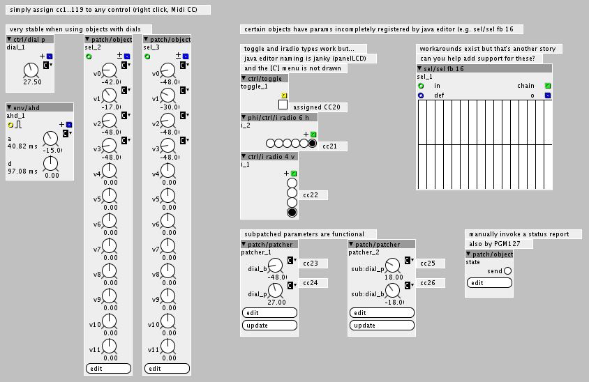
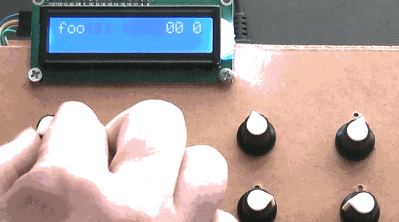
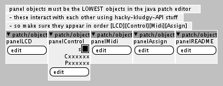
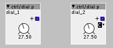

# AxoPanelControls CCSystem
A hastily constructed control panel for [axoloti](https://github.com/axoloti/axoloti) and [ksoloti](https://github.com/ksoloti), 12 potentiometers, 8 switches, 1 LCD.

  

# What is this?
I find on-screen controls do not provide tactile visceral joyful control of sound. I like joyful sound... In 2016, I hastily constructed a panel with 12 rotary potentiometers, 8 push switches in an R_2R ladder to select banks of controls, and a 2x16 character display over I2C. Accompanying software (also hastilly constructed!) uses undocumented features for convenient tactile joyful etc workflow.

Here is a simple and total recall of performances using a MIDI sequencer, support for 'local on/off' with MIDI CONTROL CHANGE 122, and support for snapshot of the entire system state with MIDI PROGRAM CHANGE 127.

Simply add the panel objects to any pre-existing patch, nominate controls (up to a maximum total of 96 in 8 banks of 12), and everything just works automatically. Yay!

The [master branch](../../) presents an alternative `labelsystem`.

# Software overview
The software monitors rotary control and bank selection switch state and reacts appropriately. Preferred workflow is to add ccsystem objects to an existing patch and assign MIDI cc which will then be assigned to upto 8 banks of 12 physical controls. When turning a physical control, the LCD clearly identifies the parameter label, current bank, and any unused banks or controls. All changes are “hooked” (aka “pickup”) which avoids sudden jumps when switching banks.

A good starting point is `ccsystem1t.axp` which includes a complete demonstration of the system. Since AXP “patch” files can contain embedded C sourcecode you may copy-paste into your own patches to enjoy.

| Filename | Description |
|----------|-------------|
| `ccsystem1t.axp` | Demonstration. Start here! |

Objects
All objects are required. Do you need support for OLED displays over SPI? Controls from I2C ADC modules? Hack on my code. :)

| Object | Description |
|--------|-------------|
| `panelLCD` | Display recently touched control labels and identifiy used/unused clearly. 
| | *Requires I2C 2x16 LCD using pins PB8=SCL and PB9=SDA.* |
| `panelControl` | Controls patch parameters using physical controls. 
| | *Monitors 12 potentiometers and a button array with R-2R ladder and modifies patch parameter values accordingly.* |
| `panelMidi` | Handles DIN and USB MIDI messaging. 
| | *Reports controller state for any adjusted parameter as MIDI messages on either or both DIN and USB MIDI.* |
| `panelAssign` | Assigns nominated parameters to `panelControl` and `panelDisplay`. 
| | *Objects with parameters assigned MIDI CC (with the right-click menu in the java editor) from CC#1..119 are nominated. Subpatch 'on parent' parameters are supported.  Not all parmameter types are supported yet – can you help?* |

The C code (ab)uses, to my knowledge undocumented, features of the Java based software editor related to parameter handling. Everything works well on firmware E95BAC96 and editor 1.0.12, but no other configuration has been tested. Send bug reports, fix bugs, teamwork, yay! :)

# Suggested usage
See the demonstration in `ccsystem1t.axp` for suggested methods of usage and workflow. The simplest way to assign parameters to hardware control is to use the right-click menu in the java editor to assign a MIDI CC to a parameter. The editor will show a small `[C']` next to dials that have been assigned. 

Parameters inside subpatches using 'on parent' are supported. Even sub-subpatched parameters are supported although the parameter label will not always be shown correctly on the LCD in this case.

The [master branch](../../) presents an alternative `labelsystem`.

---
Not all parameter types are supported. I need help to support ctrl/toggle, ctrl/button, ctrl/cb16, ctrl/i, and ctrl/i radio types. CAN YOU HELP?
---
