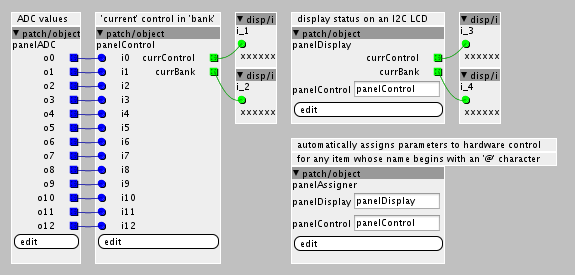
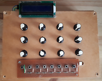
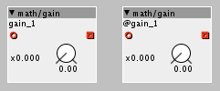

# Axoloti (and Ksoloti) panel controls
A hastily constructed control panel for axoloti and ksoloti, 12 potentiometers, 8 switches, 1 LCD.

 

# What is this?
Axoloti boards designed by Johannes Taelman (and clones like Ksoloti) are programmed and configured using a software editor. I find on-screen controls do not provide tactile visceral joyful control of sound. I like joyful sound... In 2016, I hastily constructed a panel with 12 rotary potentiometers, 8 push switches in an R_2R ladder to select banks of controls, and a 2x16 character display over I2C. Accompanying software (also hastilly constructed!) uses undocumented features for convenient tactile joyful etc workflow. Simply “paste-in” objects to any pre-existing patch, nominate controls (up to a maximum total of 96 in 8 banks of 12), and everything just works automatically. Yay!

# Software overview
The software monitors rotary control and bank selection switch state and reacts appropriately. Preferred workflow is to add labelsystem objects to an existing patch and nominate (more on that later) which parameters will be assigned to hardware controls. If more than 12 parameters are nominated, the system can use upto 8 banks of 12. When turning a physical control the 2x16 LCD clearly identifies the parameter label, current bank, and any unused banks or controls. All changes are “hooked” (aka “pickup”) which avoids sudden jumps when switching banks.

A good starting point is labelsystem5a.axp which includes a complete demonstration of the system. Since AXP “patch” files can contain embedded C sourcecode you may copy-paste into your own patches to enjoy.

| Filename | Description |
|----------|-------------|
| `labelsystem5a.axp` | Demonstration. Start here! |
| `labelsystem5a-chart.axp` | With disp/chart/p useful to debug hardware. |

Objects
All objects are required. Do you need support for OLED displays over SPI? Controls from I2C ADC modules? Hack on my code. :)

| Object | Description |
|--------|-------------|
| `panelADC` | Reports 13 ADC values from hardware controls. 
| | *Requires 12 potentiometers and a button array with R-2R ladder.* |
| `panelControl` | Controls patch parameters using inputs from panelADC. 
| | *Reports the state of the system as two int32 values. curControl = which control is touched,  curBank = which bank of controls is selected.* |
| `panelAssigner` | Assigns nominated parameters to panelControl and panelDisplay. 
| | *Checks objects whose name begins with an '@' character. Truncates names if necessary. Not all parmameter types are supported yet – can you help? Subpatches with 'child' parameters are supported somewhat.* |
| `panelDisplay` | Display recently touched control labels and identifiy used/unused clearly. 
| | *Requires I2C 2x16 LCD using pins PB8=SCL and PB9=SDA.* |

The C code (ab)uses, to my knowledge undocumented, features of the Java based software editor related to parameter handling. Everything works well on firmware E95BAC96 and editor 1.0.12, but no other configuration has been tested. Send bug reports, fix bugs, teamwork, yay! :)

# Suggested usage
See the demonstration in labelsystem5a.axp for suggested methods of usage and workflow. The simplest way to assign parameters to hardware control is to rename with the first character as an '@' symbol. For example `gain_1` becomes `@gain_1`.



Parameters inside subpatches using 'on parent' are supported. A portion of the parent identifier of the parent will be shown on the LCD. Long identifiers are truncated preserving first and last characters.

```
Not all parameter types are supported. I help to support ctrl/toggle, ctrl/button, ctrl/cb16, ctrl/i, and ctrl/i radio types. CAN YOU HELP?
```
