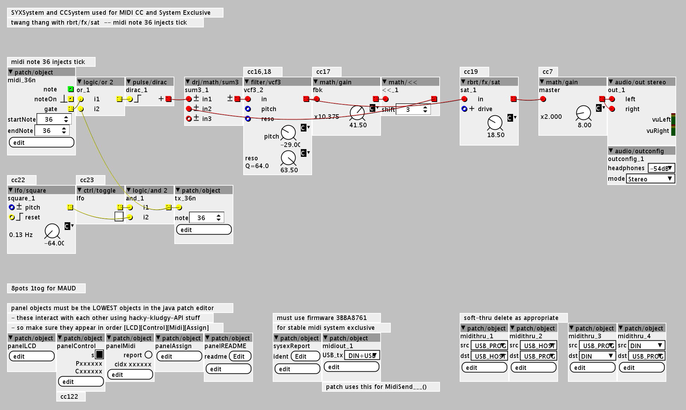
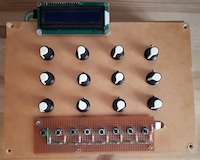
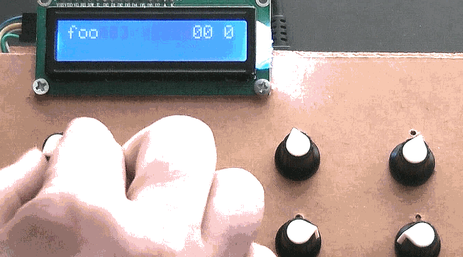
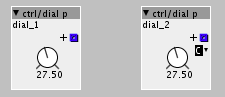

# AxoPanelControls SYXSystem
A hastily constructed control panel for [axoloti](https://github.com/axoloti/axoloti) and [ksoloti](https://github.com/ksoloti), 12 potentiometers, 8 switches, 1 LCD.

  

# What is this?
I find on-screen controls do not provide tactile visceral joyful control of sound. I like joyful sound... In 2016, I hastily constructed a panel with 12 rotary potentiometers, 8 push switches in an R_2R ladder to select banks of controls, and a 2x16 character display over I2C. Accompanying software (also hastilly constructed!) uses undocumented features for convenient tactile joyful etc workflow.

My software provides a simple and total recall of performances using a MIDI sequencer with MIDI CONTROL CHANGE messages, and support for snapshot of the entire system state with MIDI SYSTEM EXCLUSIVE. Soft-thru from DIN to USB MIDI and any combination is also provided.

Ksoloti and Axoloti firmware E95BAC96 has 'quirky' midi handling of system exclusive data. Use [My custom firmware with minor bugfixes](https://github.com/zenpho/ks1.0.12/tree/midi-patch) improves MIDI handling and I can confirm stable behaviour. 

Simply add the panel objects to any pre-existing patch, nominate controls (up to a maximum total of 96 in 8 banks of 12), and everything just works automatically. Yay!

## Store and recall

A MIDI PROGRAM CHANGE #127 (and panel switches) transmits parameter values as both MIDI CONTROL CHANGE values and MIDI SYSTEM EXCLUSIVE data. These may be recorded by a MIDI sequencer and retransmitted to the hardware for simple and total recall of the system state. 

I find it useful to save multiple 'snapshot' MIDI files on disk. This way I can capture and transmit any previously captured system state whilst any patch is running standalone. I typically disable the axoloti/ksoloti editor preset feature.

See also [labelsystem](../../) and [ccsystem](../../tree/ccsystem) alternative systems.

# Software overview
The software monitors rotary control and bank selection switch state and reacts appropriately. Preferred workflow is to add syxsystem objects to an existing patch and assign MIDI cc which will then be assigned to upto 8 banks of 12 physical controls. When turning a physical control, the LCD clearly identifies the parameter label, current bank, and any unused banks or controls. All changes are “hooked” (aka “pickup”) which avoids sudden jumps when switching banks.

A good starting point is `syxsystem1e.axp` which includes a complete demonstration of the system. Since AXP “patch” files can contain embedded C sourcecode you may copy-paste into your own patches to enjoy.

| Filename | Description |
|----------|-------------|
| `syxsystem1e.axp` | Demonstration. Start here! For front panel layout with 12 pots and 4 toggle switches. |
| `syxsystem1m.axp` | Alternative demonstration for panel with 8 pots and 2 toggle switches. |

## Objects
All objects are required. Do you need support for OLED displays over SPI? Controls from I2C ADC modules? Hack on my code. :)

| Object | Description |
|--------|-------------|
| `midiOut` | Specifies if MIDI transmission will be via DIN MIDI or DIN + USB MIDI simultaneously. |
| | *MIDI reception is always via DIN and USB MIDI simultaneously.* |
| `sysexReport` | Handles DIN and USB MIDI SYSTEM EXCLUSIVE messaging. |
| | *Provides store and recall of parameters as MIDI system exclusive data via either or both DIN and USB MIDI.* |
| `panelLCD` | Display recently touched control labels and identifiy used/unused clearly. 
| | *Requires I2C 2x16 LCD using pins PB8=SCL and PB9=SDA.* |
| `panelControl` | Controls patch parameters using physical controls. 
| | *Monitors 12 potentiometers and a button array with R-2R ladder and modifies patch parameter values accordingly.* |
| `panelMidi` | Handles DIN and USB MIDI CONTROL CHANGE messaging. 
| | *Reports controller state for any adjusted parameter as MIDI messages on either or both DIN and USB MIDI.* |
| `panelAssign` | Assigns nominated parameters to `panelControl` and `panelDisplay`. 
| | *Objects with parameters assigned MIDI CC (with the right-click menu in the java editor) from CC#1..119 are nominated. Subpatch 'on parent' parameters are supported.  Not all parmameter types are supported yet – can you help?* |

The C code (ab)uses, to my knowledge undocumented, features of the Java based software editor related to parameter handling. 

# Suggested usage
The simplest way to assign parameters to hardware control is to use the right-click menu in the java editor to assign a MIDI CC to a parameter. The editor will show a small `[C']` next to dials that have been assigned. 

Parameters inside subpatches using 'on parent' are supported. Even sub-subpatched parameters are supported although the parameter label will not always be shown correctly on the LCD in this case.

---
LCD behaviour is workable but not ideal with ctrl/toggle, ctrl/button, ctrl/cb16, ctrl/i, and ctrl/i_radio types. CAN YOU HELP?
---
